<h3 align="center">Welcome to FPS3</h3>

Here, you will have infinite fun from playing this game.

 
 
 
 
 
 
 
 
 
 
 
 
 

> ### :exclamation: Beta release 1.0
> Version 1.0 has been released as a beta release. In a beta release, things are playable and usable, but some items and in-game features will still be updated until 4/16/23 as "beta version 4.0".
> 
> Read the below documentation to learn more about what has been released.

## Why it is better then all other FPS games
With the FPS series (FPS, FPS2, and FPS3), all of the games jurastically change on each game.

With FPS, it was simple, but nothing special compared to other games.

With FPS2, things started getting a little better. New technology was added like advanced AI bot system and other tools.

But imagine the leap between FPS and FPS2, how things got so much better. Imagine 20x that, and that's FPS3.

But back to the subject, FPS3 is unique from all other FPS games. Here's why:

- It has simple, yet realistic and high performance graphics
- It is a web game you can setup in your browser in seconds
- It is built entirely of JavaScript
- The features and UI controls are easy to use
- It has 10 different in-game modes
- It is completely free to play

## Documentation
In the documentation, you'll get an idea just how to play the game, use all the menus, and level up your game.

### Getting started

#### Starting a game
Like mentioned earlier, FPS3 and all FPS games in the series are browser games.

Which literally means you can open your browser, click a link and start playing.

*How do you do this though?*

- Go to [FPS3.serveo.net](https://www.fps3.ml)
- To start a game, click <kbd>PLAY</kbd>
- Select your game mode by using the arrows
- Click <kbd>Start</kbd> and wait for players to join

And just like that, in 4 simple steps, you're playing an FPS game.

*No download, payment, setup, sign up or anything required.*

#### Keeping your info saved
If you didn't think it could get any better, you can also __sign up__ and keep things like __medals__, __kills__, __points__ and __profile information__ saved.

To sign up and keep your awesome progress saved,

- Go to [FPS3.serveo.net](https://www.fps3.ml)
- Click <kbd>OPTIONS</kbd>
- Click __LOG IN/SIGN UP__
- Enter the following:

> Username: A short username to identify yourself (Not your real name!) 
> Email: A verified email address so you can save your account (incase of lost info, e.g., forgotten password). 
> Password: A secure password that no one can guess, but you. Do not use characters like "%", "^" and "#"

- Click <kbd>Submit</kbd>
- Verify your email
- Log in using that info

Just start playing games now, and all rewards and info will be saved!

#### Using the store
Even if you thought it stopped right there, you can widely customize the game too!

By buying items in the store, we mean with fake currency (points), FPS3 is a completely free game.

Read [How to get points](#how-to-get-points) to learn how to get points to buy stuff in the store.

To get new cool items,
- Go to [FPS3.serveo.net](https://www.fps3.ml)
- Log in or sign up
- Go back to the menu
- Click <kbd>STORE</kbd>
- Buy whatever you want.

But you can't use the stuff you buy, unless you change it in your preferences.

#### Changing preferences
To customize *everything*, all you need to do is
- Go to [FPS3.serveo.net](https://www.fps3.ml)
- Log in or sign up
- Go back to the menu
- Click <kbd>OPTIONS</kbd>
- Click __EDIT/VIEW SETTINGS__
- Customize anything you want

#### How to get points
You can easily get points using the following methods:
- Playing a game (losing will still earn you 50 points!)
- Answering daily poll
- Discovering game features
- Starring the repository
- Signing up

### What to do
The goal of each game is based on its mode.

All mode definitions below.

> Slayer: Eliminate player(s) to earn points.

> Fiesta: Eliminate player(s) using random weapons to earn points.

> Snipers: Eliminate player(s) using sniper rifles to earn points.

> Oddball: Hold the ball, each second held earns a point.

> Fistfight: Eliminate player(s) using knives to earn points.

> CTF: Capture the enemy flag to earn points.

> KoTH: Stay in the aqquired target zone, each second standing earns a point.

In each description, it will tell you "earn points" or "earns a point". This means you need to do the description however many times the score limit is to win.

## Comparison
Here's an overall list of comparing FPS3 to FPS and FPS2.

### 1. UI
In the last games, we've made it simple and easy to use.

But most video games are not simple, simple meaning it sticks to one theme, and not a lot of features.

Here's the difference between the menu in __FPS__ and __FPS2__:

  
Show comparison

  <kbd>
    
    
  </kbd>

And here's the difference between the menu in __FPS2__ and __FPS3__:

  
Show comparison

  <kbd>
    
    
  </kbd>

### 2. Features
The last games had some of these features, but they were mostly poor and thrown together.

We've mad some improvements though, and the game will be more like a Console/PC game.

So this game will include the following:

*"__-__" meaning it has already been added in the past. "__+__" meaning it is a new feature.*

__-__ The store 
__+__ Wide customization 
__-__ Log in/Sign up 
__+__ Advanced AI system 
__+__ New simple style 
__+__ Advanced controls/options 
__+__ Profile system 
__+__ New advanced chat 
__+__ 24/7 Support 
__+__ Touch controls 
__+__ Gamepad Controls

### 3. Performance
Of course, on every project in the FPS series, there always has to be a performance comparison too.

The device tested that can handle the game the best is an __iPad 8th Generation__.

Before, on FPS2, only laptops could run FPS2 because of the low battery performance and lag/support.

Now FPS3 can run on mobile (including iPads, the newest iPhones and android tablets) plus it can run on desktop devices.

### 3. Controls
In FPS and FPS2, we've upgraded from selecting menu buttons with a gamepad, to an entire virtual keyboard using a gamepad.

But how are the controls in FPS3?

FPS3 has an entire touch screen control UI in-game, plus upgraded full support for ANY gamepad (Xbox, PlayStation, etc.).

### 4. Misc
In FPS and FPS2 the Misc are all the same. Ordinances, Weapons, Vehicles, etc.

But in FPS3 we've added all of the following:

> Ammo will not be in weapons automatically. You must find ammo scattered on the battle field.

> Picking up weapons will now drop your current weapon in exchange.

> Vehicles now have responsive collision detection, plus a wide variety of more vehicles and controls for them.

> There were only 2 maps in FPS and 3 in FPS2. Now we have 5+ responsive maps to select from.

> There are about twice as many weapons as FPS and FPS2 combined, with all different functions.

> There are also more modes for the game that actually work unlike FPS2.

> You can now instantly start a game in 2 clicks without any extra work.

> New advanced AI and bot systems that act like humans have been added.

### An overall score
Here is the overall rating compared to FPS and FPS2:

__FPS:__ 31/100

__FPS2:__ 65/100

__FPS3:__ 90/100

[What do you think of our comparison?](https://github.com/Parking-Master/FPS3/discussions/1)

## The game
The actual game has a lot to surprise you with.

Here's what will be listed:

> Weapons, Vehicles, Grenades, Ammo, Characters, Themes, Loadouts, and AI.

### Weapons (13)
###### _Note: Items are listed from oldest added to newly added._
#### Assault Rifle

The full auto AK-47 makes a good starter weapon with how much ammo it can hold and how much damage it can produce.

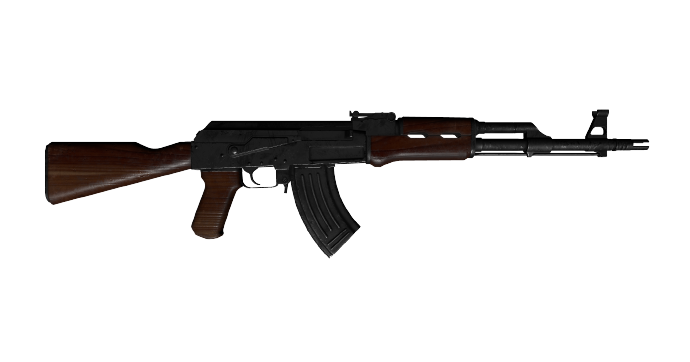
 

- __Ammunition Damage__ (per shot): 5/100
- __Ammunition Range__ (per dist/un): 0.25/10
- __Recoil__ (single fire): 7/100
- __Recoil__ (burst fire): 15/100
- __Recoil__ (rapid fire): 19/100
- __Sound__ (decibals): d/v _(v=volume_rate\*100,d=volume\*10)_

#### Glock 19

The 19th variant of Glock pistols (Glock 19) has almost no damage but can be used as a mid-range gun.

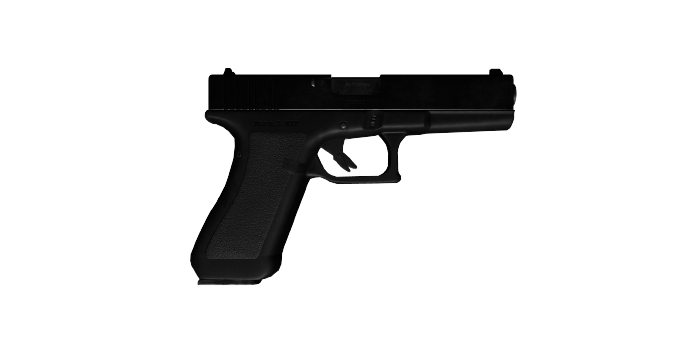
 

- __Ammunition Damage__ (per shot): 3/100
- __Ammunition Range__ (per dist/un): 0.15/10
- __Recoil__ (single fire): 4/100
- __Recoil__ (burst fire): 10/100
- __Recoil__ (rapid fire): 12/100
- __Sound__ (decibals): d/v _(v=volume_rate\*100,d=volume\*6)_

#### Sniper Rifle

The Sniper Rifle has ultimate power with a 10x zoom scope, laser sights and 75/100 average damage/range.

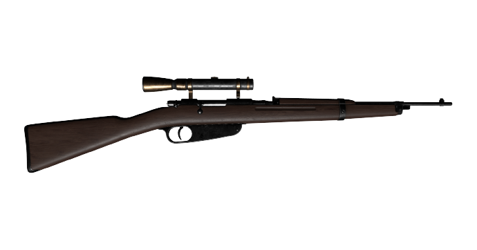
 

- __Ammunition Damage__ (per shot): 50/100
- __Ammunition Range__ (per dist/un): 5/10
- __Recoil__ (single fire): 10/100
- __Recoil__ (burst fire): 16/100
- __Recoil__ (rapid fire): 22/100
- __Sound__ (decibals): d/v _(v=volume_rate\*100,d=volume\*18)_

#### Micro Uzi

The Micro Uzi uses a 3-round-burst system that can instantly fire 3 rounds at a time, making it a damaging weapon.

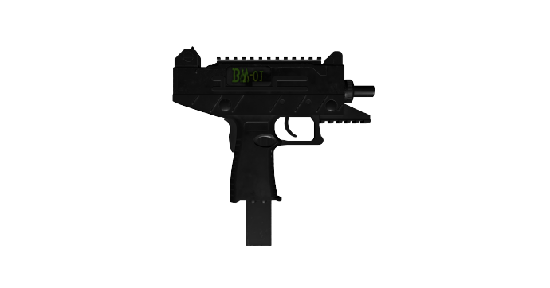
 

- __Ammunition Damage__ (per shot): 3/100
- __Ammunition Range__ (per dist/un): 0.15/10
- __Recoil__ (single fire): 2/100
- __Recoil__ (burst fire): 5/100
- __Recoil__ (rapid fire): 9/100
- __Sound__ (decibals): d/v _(v=volume_rate\*100,d=volume\*15)_

#### Auto Pistol

The Auto Pistol is a machine pistol that is so fast it can fire 20 rounds in the time you can blink (40ms).

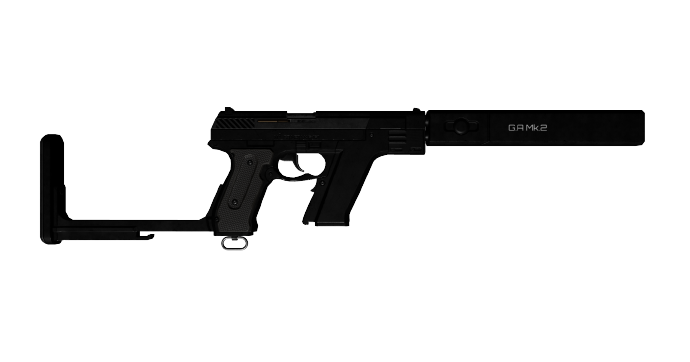
 

- __Ammunition Damage__ (per shot): 50/100
- __Ammunition Range__ (per dist/un): 5/10
- __Recoil__ (single fire): 10/100
- __Recoil__ (burst fire): 16/100
- __Recoil__ (rapid fire): 22/100
- __Sound__ (decibals): d/v _(v=volume_rate\*100,d=volume\*18)_

#### Light Machine Gun

The LMG (Light Machine Gun) is an all-in-one assault rifle machine gun, able to carry by hand. Its only downside is the slow firing.

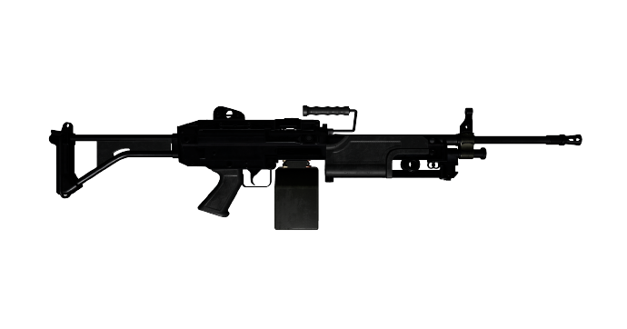
 

- __Ammunition Damage__ (per shot): 5/100
- __Ammunition Range__ (per dist/un): 0.25/10
- __Recoil__ (single fire): 10/100
- __Recoil__ (burst fire): 14/100
- __Recoil__ (rapid fire): 20/100
- __Sound__ (decibals): d/v _(v=volume_rate\*100,d=volume\*11)_

#### Shotgun

This 12-guage Shotgun can be very damaging or very delicate, it basically depends on where you aim it.

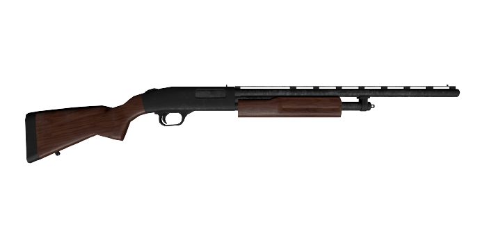
 

- __Ammunition Damage__ (per shot): 30/100
- __Ammunition Range__ (per dist/un): 7/10
- __Recoil__ (single fire): 15/100
- __Recoil__ (burst fire): 30/100
- __Recoil__ (rapid fire): 55/100
- __Sound__ (decibals): d/v _(v=volume_rate\*100,d=volume\*20)_

#### Rocket Pistol

This pistol really makes a thump once you find out it fires tiny rockets.

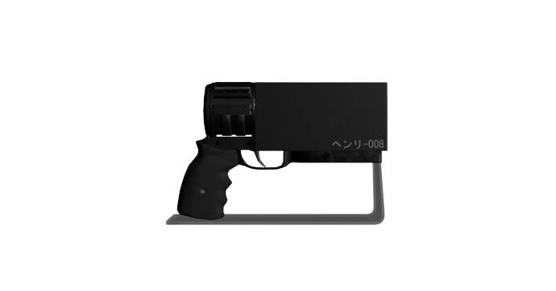
 

- __Ammunition Damage__ (per shot): 100/100
- __Ammunition Range__ (per dist/un): 3/10
- __Recoil__ (single fire): 10/100
- __Recoil__ (burst fire): 20/100
- __Recoil__ (rapid fire): 26/100
- __Sound__ (decibals): d/v _(v=volume_rate\*100,d=volume\*3)_

#### Grenade Launcher

The Grenade Launcher is a reliable weapon, but only good when fighting in big battlefields.

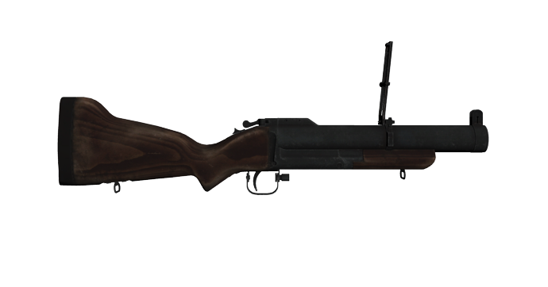
 

- __Ammunition Damage__ (per shot): 100/100
- __Ammunition Range__ (per dist/un): 4/10
- __Recoil__ (single fire): 10/100
- __Recoil__ (burst fire): 11/100
- __Recoil__ (rapid fire): 11/100
- __Sound__ (decibals): d/v _(v=volume_rate\*100,d=volume\*9)_

#### Wire Rifle

The Wire Rifle gets its name because it shoots a stream of 7,000°f fire (also called wire).

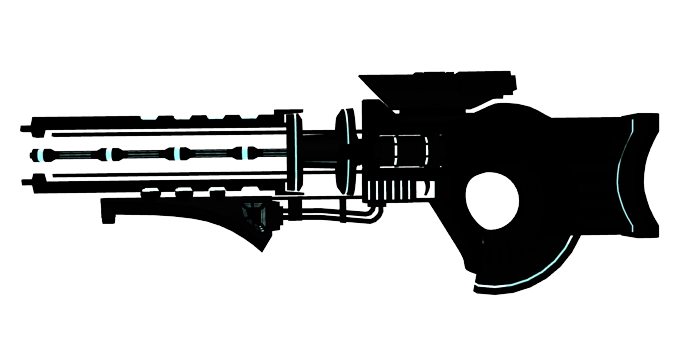
 

- __Ammunition Damage__ (per shot): 100/100
- __Ammunition Range__ (per dist/un): 10/10
- __Recoil__ (single fire): 91/100
- __Recoil__ (burst fire): 200/100
- __Recoil__ (rapid fire): ∞/100
- __Sound__ (decibals): d/v _(v=volume_rate\*100,d=volume\*18)_

#### Turret

The Turret is a well known MG that can also be attached/detached from some vehicles.

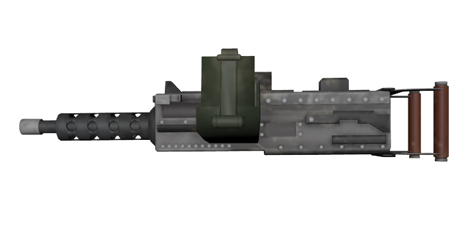
 

- __Ammunition Damage__ (per shot): 5/100
- __Ammunition Range__ (per dist/un): 5/10
- __Recoil__ (single fire): 10/100
- __Recoil__ (burst fire): 20/100
- __Recoil__ (rapid fire): 25/100
- __Sound__ (decibals): d/v _(v=volume_rate\*100,d=volume\*10)_

#### Knife

The Knife is the basic melee weapon with an FPS-style shape and feature to it.

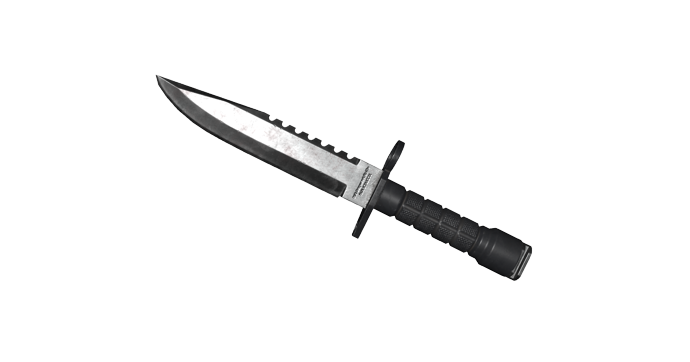
 

- __Ammunition Damage__ (per shot): 100/100
- __Ammunition Range__ (per dist/un): 1/10
- __Recoil__ (single fire): 2/100
- __Recoil__ (burst fire): 2/100
- __Recoil__ (rapid fire): 2/100
- __Sound__ (decibals): d/v _(v=volume_rate\*100,d=volume\*1)_

#### Tactical Shotgun

The Tactical Shotgun is basically just an extremely sawed-off double-barrel Shotgun, that looks like a pistol.

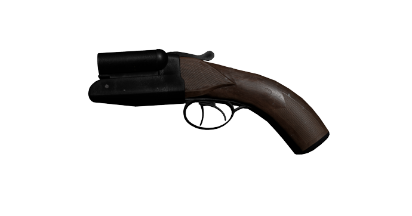
 

- __Ammunition Damage__ (per shot): 10/100
- __Ammunition Range__ (per dist/un): 6/10
- __Recoil__ (single fire): 10/100
- __Recoil__ (burst fire): 15/100
- __Recoil__ (rapid fire): 17/100
- __Sound__ (decibals): d/v _(v=volume_rate\*100,d=volume\*12)_

### Maps (6)
#### Cargo
The Cargo-Shipment map has been in every FPS game in the series. It is well known for how many players it can fit, and its performance.
<kbd>
  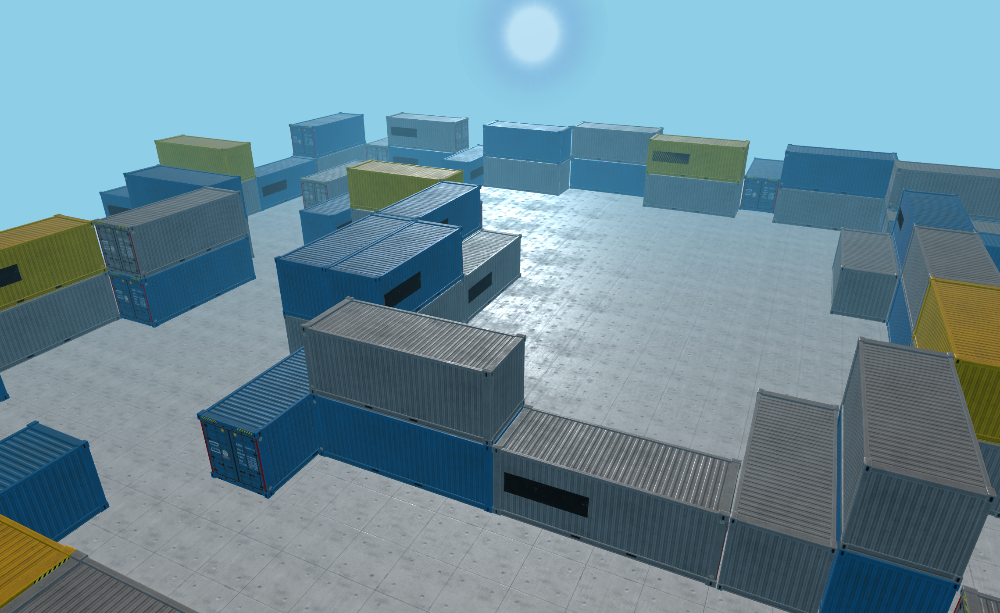
</kbd>

#### Storage
The Storage map is an airplane-hangar based map with different hiding spots, rooms and places to climb.
<kbd>
  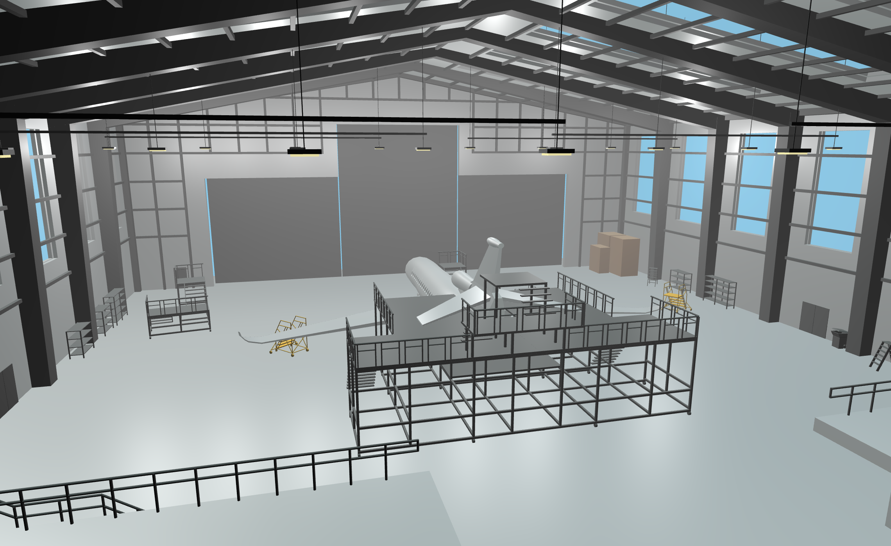
</kbd>

#### Complex
As a city-style map, Complex is known for how big it is. It has been in FPS2 but has been remade for style, performance and area.
<kbd>
  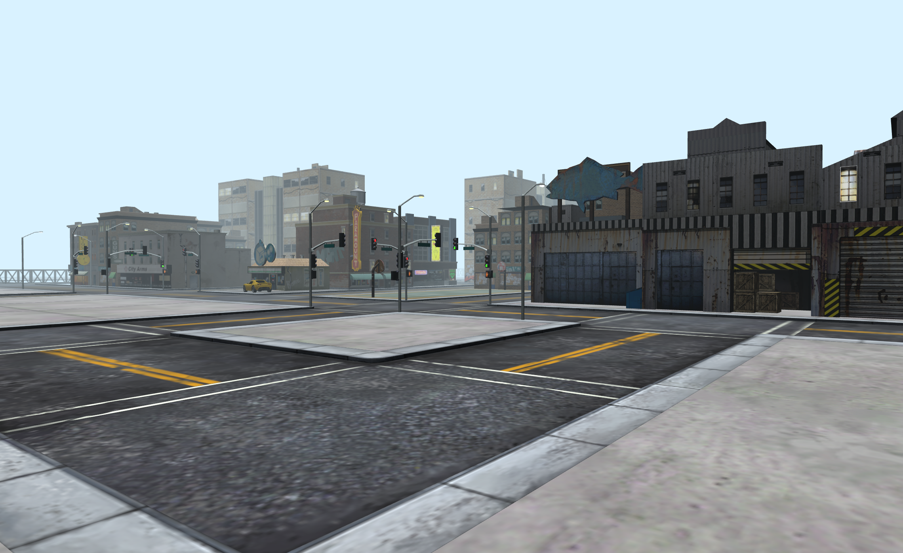
</kbd>

#### Lihid
Lihid was once used as a storage facility for gold mining in the desert. It was abandoned and many have lost its location.
<kbd>
  
</kbd>

#### Aero
As you can tell, Aero is on the moon because earth is right next to it. Its rocky large surface and craters make a great FPS map.
<kbd>
  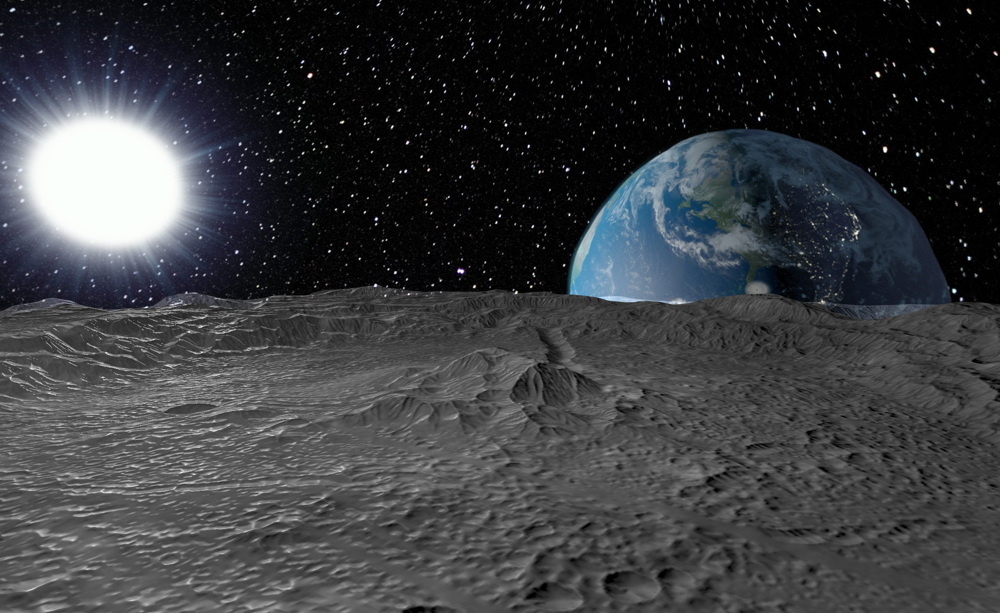
</kbd>

#### Venus
Venus is the 2nd planet from the sun. Due to its thick atmosphere, it traps heat and radiation making it well over 800°f.
<kbd>
  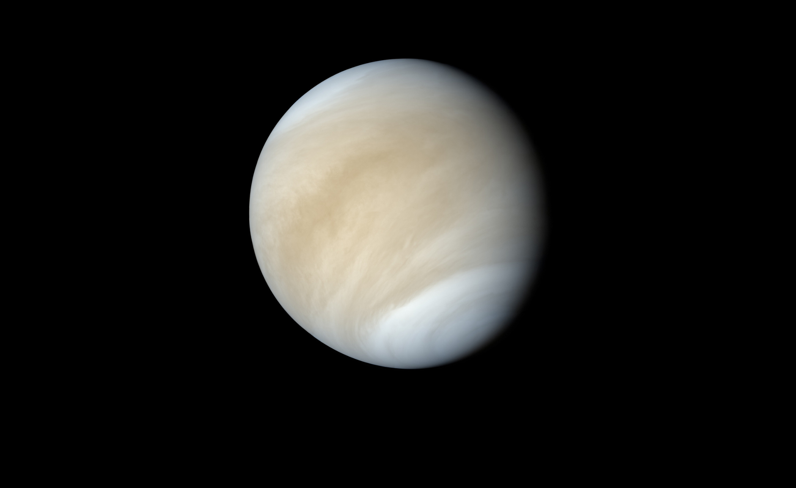
</kbd>

### Characters (2)
#### Steve
Steve the Soldier is a basic character that every account comes with for free.
 
<kbd>
  
</kbd>

#### Max
Max is a legendary soldier that likes heavy weapons and big equipment.
 
<kbd>
  
</kbd>

### Vehicles (1)
#### Humvee
The Humvee is a military vehicle based on the Hummer H1 model. It was chosen because of its war-based capabilties like wideness, heaviness and strength. It is also equipped with the Turret MG.
 
<kbd>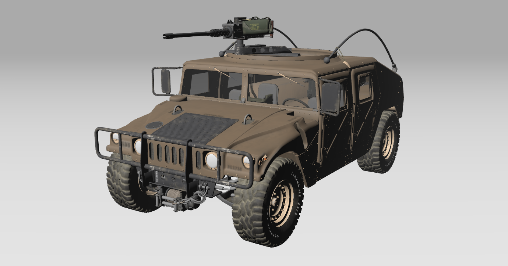</kbd>

## Contributions
- @Parking-Master

## Support
If you have any questions or are unfamiliar with something, you may contact us below.

- [parkingmaster@email.com](mailto:parkingmaster@email.com)

- [fps5@mail.com](mailto:fps5@mail.com)

Or you can ask us about your problem in the "Issues" section.

## Supporting *@Parking-Master*
If you would like to support the projects, go ahead and hit the "Star" button.

*You can also support @Parking-Master by just playing the game!*

Make sure to check out our recommended projects before you leave!

[FPS2](https://github.com/Parking-Master/FPS2) | [FPS](https://github.com/Parking-Master/FPS) | [Parking Master 2.0](https://github.com/Parking-Master/Parking-Master-2.0) | [Gametime.js](https://github.com/Parking-Master/Gametime.js)

# License
Licensed under the MIT license.

###### Copyright (c) 2021-2023 Parking Master games
